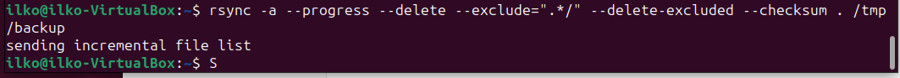
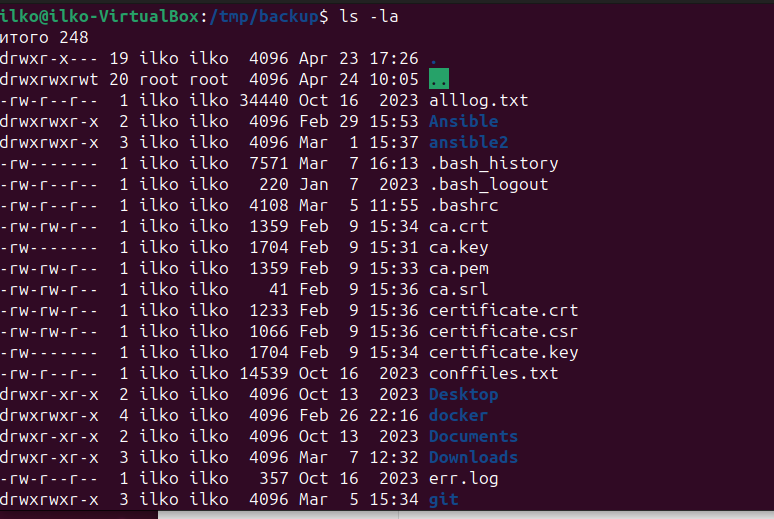
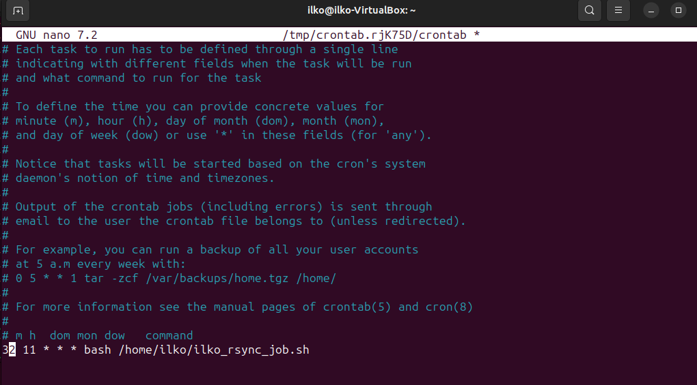

# Домашнее задание к занятию 3 "Резервное копирование" - 

### Задание 1

1. Команда **Rsync**, которая позволяет создавать зеркальную копию **/home/ilko** в расположении **/tmp/backup**:
```
ilko@ilko-VirtualBox:~$ rsync -a --progress --delete /home/ilko /tmp/backup
```
2. Добавим исключение из синхронизации всех скрытых директорий (начинающихся с ".") и удаление уже добавленных:
```
ilko@ilko-VirtualBox:~$ rsync -a --progress --delete --exclude=".*/" --delete-excluded . /tmp/backup
```
3. Добавим проверку контрольных сумм файлов:
```
ilko@ilko-VirtualBox:~$ rsync -a --progress --delete --exclude=".*/" --delete-excluded --checksum . /tmp/backup
```




### Задание 2

Создадим скрипт файл **ilko_rsync_job.sh**, который будет осуществлять копирование домашней директории пользователя
**/home/ilko** в **/tmp/backup**:
```
#!/bin/bash
if $(rsync -a --delete --exclude=".*/" --delete-excluded --checksum /home/ilko /tmp/backup); then
echo "$(date) RSYNC: Копия домашней директории пользователя создана успешно" >> /var/log/syslog; else
echo "$(date) RSYNC: Не удалось создать копию домашней директории пользователя" >> /var/log/syslog
fi
```
Результат выполнения резервного копирования будет записан в системный журнал **/var/log/syslog**.

Создадим расписание выполнения задания с помощью **Cron** - **ежедневно в 11:32**:
```
crontab -e
```

```
Скриншот, на котором с результатом работы утилиты:
```

